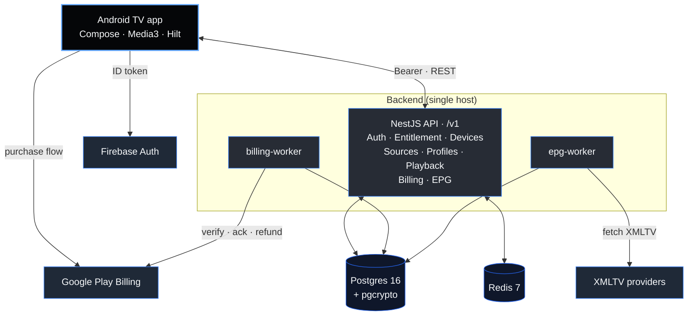

<p align="center">
  
</p>

<h1 align="center">Premium TV Player</h1>

<p align="center">
  <strong>The premium-feel, account-based TV player.</strong><br/>
  Bring your own sources. Keep your account, profiles, and devices in sync —
  on a TV experience that doesn't look like a hobby project.
</p>

<p align="center">
  <a href="./CLAUDE.md"></a>
  
  
  
  
  
</p>

<p align="center">
  <a href="./docs/i18n/OVERVIEW.md">🌍 Read this overview in 10 languages</a>
</p>

---

## Why this exists

Most "IPTV players" on Android TV today fall into one of two buckets:

- **Free, but ugly** — Material defaults, leftover phone idioms, 1990s focus rings,
  no account model. You re-enter your M3U URL on every device.
- **Polished, but device-locked** — premium UX, but tied to a single device's
  MAC address. Replace your TV, lose your sub.

**Premium TV Player** is the third option:

| | Most free players | Premium TV Player |
|---|---|---|
| **UI quality bar** | Material defaults | Bespoke design system, 10-foot UI hierarchy, focus-veil pattern, motion that breathes |
| **Identity model** | per-device install | account-based, 5 profiles, 5 device slots |
| **Replace a TV** | re-add everything by hand | sign in, done |
| **Trial / billing** | client-side dates | server-authoritative, refund-aware, replay-safe |
| **Source storage** | plaintext on the device | AES-256-GCM at rest, fresh IV per write |
| **Parental controls** | optional, client-side | Argon2id PIN gate, server-side lockout |
| **Crashes on a kids profile** | fully exposes adult content | server enforces age cap before the row even reaches the device |

We don't host content. We host **the product around the content** — auth,
entitlement, parental controls, device slots, watch history. The user
brings the M3U / XMLTV sources.

---

## Architecture in 30 seconds



Two non-negotiables:

1. **Server is the source of truth.** Trial start, refund handling, slot caps,
   PIN lockout — all decided by the API. The app never trusts a local timestamp.
2. **Account &gt; device.** Slots are issued and revoked centrally; tokens are
   sha-256-hashed at rest. Never MAC-bound, full stop.

Deeper dives: [data model](./docs/architecture/data-model.md) &middot;
[entitlement state machine](./docs/architecture/entitlement-state-machine.md) &middot;
[OpenAPI contract](./packages/api-contracts/openapi.yaml).

---

## Quick start

```bash
# 1. Backend (data plane + API)
docker compose -f infra/docker/docker-compose.yml up -d
cd services/api && cp .env.example .env && npm install
npx prisma migrate deploy && npm run start:dev          # → :3000/v1

# 2. Workers (separate processes)
cd services/billing-worker && npm install && npm run start
cd services/epg-worker     && npm install && npm run start

# 3. Android TV (drop your Firebase keys into apps/android-tv/local.properties)
./gradlew -p apps/android-tv :app:installDebug
```

Full setup, env reference, troubleshooting: [`services/api/README.md`](./services/api/README.md)
&middot; [`apps/android-tv/README.md`](./apps/android-tv/README.md).
Production deployment, hardening, restore drill, runbooks:
[`docs/operations/`](./docs/operations/).

---

## Quality bar

Every commit on this repo passes three CI gates before it lands:

```bash
./scripts/check-drift.sh           # 8 invariants (API, i18n, nav, tokens)
cd services/api && npm test        # 143 backend + workers + parsers tests
./apps/android-tv/gradlew -p apps/android-tv :app:testDebugUnitTest  # Android JVM unit tests (CI job: android-jvm-tests)
```

Drift gate enforces, in 8 invariants:

1. Every Nest controller route is on the Retrofit interface (or explicitly exempt)
2. Every Retrofit route exists in a Nest controller
3. Every `R.string.X` in Kotlin exists in `values/strings.xml`
4. Every `R.string.X` in Kotlin exists in `values-de/strings.xml`
5. Every `Routes.X` reference resolves to a constant in `Routes.kt`
6. Every `composable(Routes.X)` in NavHost references a defined route
7. No raw `Color(0x…)` literals outside `ui/theme/Color.kt`
8. No raw `TextStyle(…)` literals outside `ui/theme/Type.kt`

Test coverage hits the things that matter: entitlement transitions
(every event × every state), AES-256-GCM round-trip + tamper rejection,
PIN Argon2id lockout, billing replay/idempotency, every repository's
ErrorEnvelope mapping, every ViewModel state transition.

---

## Roadmap

```
Phase A — Foundation & Specs                ✓ Run 1–5
Phase B — Backend V1                        ✓ Run 6–10
Phase C — Android TV Client                 ✓ Run 11–18
Phase D — Polish & Ship-Ready               ⏳ Run 19 done · Run 20 pending

```

The full 20+-run plan, locked product decisions, and per-run protocol live
in [`CLAUDE.md`](./CLAUDE.md).

---

## Documentation map

| Read this | When |
|---|---|
| [`CLAUDE.md`](./CLAUDE.md) | starting any work — locked decisions, current run, run log |
| [`docs/CONTRIBUTING.md`](./docs/CONTRIBUTING.md) | before your first commit — doc-drift contract + per-surface ownership |
| [`docs/product/PRD.md`](./docs/product/PRD.md) | understanding the product |
| [`docs/product/user-flows.md`](./docs/product/user-flows.md) | 17 mermaid flows, end-to-end |
| [`docs/architecture/data-model.md`](./docs/architecture/data-model.md) | the 15-table relational model |
| [`docs/architecture/entitlement-state-machine.md`](./docs/architecture/entitlement-state-machine.md) | states · transitions · billing event mapping |
| [`docs/operations/`](./docs/operations/) | secrets · hardening · restore · upgrade · 10 incident runbooks |
| [`packages/api-contracts/openapi.yaml`](./packages/api-contracts/openapi.yaml) | the V1 HTTP contract |
| [`apps/android-tv/README.md`](./apps/android-tv/README.md) | client architecture · component catalog |
| [`services/api/README.md`](./services/api/README.md) | API quickstart · env reference |

---

## Principles we will not bend

- **Never** MAC-address-based device binding. Slots are server-managed, account-bound.
- **Never** trust client-side trial / entitlement state. Server decides.
- **Never** ship source credentials in plaintext. AES-256-GCM at rest.
- **Never** weaken the PIN gate. Argon2id, server-side counter + lockout window.
- **Never** add an OSS license. This repo is proprietary.

---

<p align="center">
  Proprietary &middot; All Rights Reserved &middot; see <a href="./LICENSE">LICENSE</a><br/>
  <sub>© 2026 Premium TV Player</sub>
</p>
