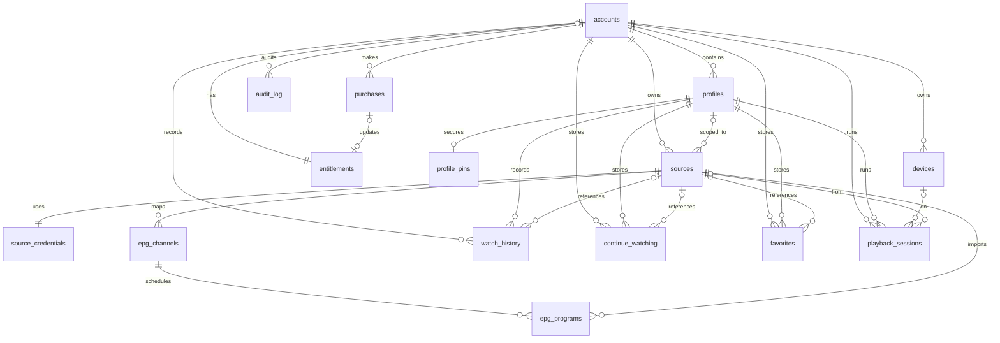

# Data Model (V1)

## Purpose
This document defines the V1 relational data model for Premium TV Player. It is the handoff baseline for Run 6 Prisma modeling and subsequent API contract work.

- Database: PostgreSQL 16+
- ID strategy: UUID primary keys (`gen_random_uuid()`)
- Time strategy: `timestamptz` in UTC
- Soft delete strategy: nullable `deleted_at` on user-managed entities
- Crypto strategy:
  - source URLs and credentials are encrypted at rest (app-level envelope encryption; DB stores ciphertext + metadata)
  - profile PINs are hashed with Argon2id (never reversible)

## Domain narrative

### Accounts and access
- `accounts` is the root tenant boundary.
- `devices` represents server-managed device slots; slot caps are enforced by entitlement + app logic:
  - `lifetime_single`: 1 active device
  - `lifetime_family`: up to 5 active devices
  - `trial`: 1 active device
- `entitlements` stores current account-level access state and lifecycle timestamps.
- `purchases` stores billing events and links to entitlement updates.

### Household model
- `profiles` belongs to `accounts` and supports kids/adult modes.
- `profile_pins` stores Argon2id hashes for PIN-protected experiences.
- App logic enforces profile cap (1 for single/trial, 5 for family).

### Sources and EPG
- `sources` stores user-owned source metadata.
- `source_credentials` stores encrypted source connection info (URL/user/pass/tokens).
- `epg_channels` and `epg_programs` cache parsed XMLTV data keyed by source.

### Playback and personalization
- `watch_history` is immutable-ish event/history rows per profile + media item.
- `continue_watching` is an upserted materialized “latest resume point”.
- `favorites` stores profile-level favorites.
- `playback_sessions` captures runtime session telemetry/heartbeats.

### Governance
- `audit_log` stores important actor/action trails for support, abuse review, and compliance.

## PostgreSQL DDL (V1)

```sql
-- Prerequisites
CREATE EXTENSION IF NOT EXISTS pgcrypto;

-- Enums
CREATE TYPE entitlement_state AS ENUM (
  'none',
  'trial',
  'lifetime_single',
  'lifetime_family',
  'expired',
  'revoked'
);

CREATE TYPE source_kind AS ENUM ('m3u', 'xmltv', 'm3u_plus_epg');
CREATE TYPE device_platform AS ENUM ('android_tv', 'android_mobile', 'web', 'ios', 'tvos', 'tizen', 'webos', 'unknown');
CREATE TYPE playback_state AS ENUM ('starting', 'playing', 'paused', 'buffering', 'stopped', 'error');

-- 1) accounts
CREATE TABLE accounts (
  id UUID PRIMARY KEY DEFAULT gen_random_uuid(),
  firebase_uid TEXT NOT NULL UNIQUE,
  email CITEXT NOT NULL UNIQUE,
  email_verified BOOLEAN NOT NULL DEFAULT FALSE,
  locale VARCHAR(16) NOT NULL DEFAULT 'en',
  trial_consumed BOOLEAN NOT NULL DEFAULT FALSE,
  status TEXT NOT NULL DEFAULT 'active', -- active | disabled | deleted
  created_at TIMESTAMPTZ NOT NULL DEFAULT now(),
  updated_at TIMESTAMPTZ NOT NULL DEFAULT now(),
  deleted_at TIMESTAMPTZ
);

-- 2) devices
CREATE TABLE devices (
  id UUID PRIMARY KEY DEFAULT gen_random_uuid(),
  account_id UUID NOT NULL REFERENCES accounts(id) ON DELETE CASCADE,
  device_token_hash TEXT NOT NULL UNIQUE,
  device_name TEXT NOT NULL,
  platform device_platform NOT NULL,
  app_version TEXT,
  os_version TEXT,
  last_ip INET,
  last_seen_at TIMESTAMPTZ,
  revoked_at TIMESTAMPTZ,
  created_at TIMESTAMPTZ NOT NULL DEFAULT now(),
  updated_at TIMESTAMPTZ NOT NULL DEFAULT now(),
  deleted_at TIMESTAMPTZ,
  CONSTRAINT devices_active_token_ck CHECK (device_token_hash <> '')
);

-- 3) profiles
CREATE TABLE profiles (
  id UUID PRIMARY KEY DEFAULT gen_random_uuid(),
  account_id UUID NOT NULL REFERENCES accounts(id) ON DELETE CASCADE,
  name VARCHAR(50) NOT NULL,
  avatar_key TEXT,
  is_kids BOOLEAN NOT NULL DEFAULT FALSE,
  age_limit SMALLINT,
  is_default BOOLEAN NOT NULL DEFAULT FALSE,
  created_at TIMESTAMPTZ NOT NULL DEFAULT now(),
  updated_at TIMESTAMPTZ NOT NULL DEFAULT now(),
  deleted_at TIMESTAMPTZ,
  CONSTRAINT profiles_age_limit_ck CHECK (age_limit IS NULL OR age_limit BETWEEN 0 AND 21)
);

-- 4) profile_pins
CREATE TABLE profile_pins (
  profile_id UUID PRIMARY KEY REFERENCES profiles(id) ON DELETE CASCADE,
  pin_hash TEXT NOT NULL,
  pin_algo TEXT NOT NULL DEFAULT 'argon2id',
  pin_updated_at TIMESTAMPTZ NOT NULL DEFAULT now(),
  failed_attempt_count INTEGER NOT NULL DEFAULT 0,
  lock_until TIMESTAMPTZ,
  created_at TIMESTAMPTZ NOT NULL DEFAULT now(),
  updated_at TIMESTAMPTZ NOT NULL DEFAULT now(),
  CONSTRAINT profile_pins_algo_ck CHECK (pin_algo = 'argon2id')
);

-- 5) entitlements
CREATE TABLE entitlements (
  id UUID PRIMARY KEY DEFAULT gen_random_uuid(),
  account_id UUID NOT NULL UNIQUE REFERENCES accounts(id) ON DELETE CASCADE,
  state entitlement_state NOT NULL DEFAULT 'none',
  trial_started_at TIMESTAMPTZ,
  trial_ends_at TIMESTAMPTZ,
  activated_at TIMESTAMPTZ,
  expires_at TIMESTAMPTZ,
  revoked_at TIMESTAMPTZ,
  revoke_reason TEXT,
  source_purchase_id UUID,
  created_at TIMESTAMPTZ NOT NULL DEFAULT now(),
  updated_at TIMESTAMPTZ NOT NULL DEFAULT now()
);

-- 6) purchases
CREATE TABLE purchases (
  id UUID PRIMARY KEY DEFAULT gen_random_uuid(),
  account_id UUID NOT NULL REFERENCES accounts(id) ON DELETE CASCADE,
  provider TEXT NOT NULL DEFAULT 'google_play',
  product_id TEXT NOT NULL,
  purchase_token TEXT NOT NULL,
  order_id TEXT,
  purchase_state TEXT NOT NULL, -- pending | purchased | canceled | refunded | revoked
  purchased_at TIMESTAMPTZ,
  acknowledged_at TIMESTAMPTZ,
  raw_payload JSONB,
  created_at TIMESTAMPTZ NOT NULL DEFAULT now(),
  updated_at TIMESTAMPTZ NOT NULL DEFAULT now(),
  CONSTRAINT purchases_provider_ck CHECK (provider IN ('google_play')),
  CONSTRAINT purchases_token_unique UNIQUE (provider, purchase_token)
);

ALTER TABLE entitlements
  ADD CONSTRAINT entitlements_source_purchase_fk
  FOREIGN KEY (source_purchase_id) REFERENCES purchases(id) ON DELETE SET NULL;

-- 7) sources
CREATE TABLE sources (
  id UUID PRIMARY KEY DEFAULT gen_random_uuid(),
  account_id UUID NOT NULL REFERENCES accounts(id) ON DELETE CASCADE,
  profile_id UUID REFERENCES profiles(id) ON DELETE SET NULL,
  name VARCHAR(120) NOT NULL,
  kind source_kind NOT NULL,
  is_active BOOLEAN NOT NULL DEFAULT TRUE,
  validation_status TEXT NOT NULL DEFAULT 'pending', -- pending | valid | invalid
  last_validated_at TIMESTAMPTZ,
  item_count_estimate INTEGER,
  created_at TIMESTAMPTZ NOT NULL DEFAULT now(),
  updated_at TIMESTAMPTZ NOT NULL DEFAULT now(),
  deleted_at TIMESTAMPTZ
);

-- 8) source_credentials
CREATE TABLE source_credentials (
  source_id UUID PRIMARY KEY REFERENCES sources(id) ON DELETE CASCADE,
  encrypted_url BYTEA NOT NULL,
  encrypted_username BYTEA,
  encrypted_password BYTEA,
  encrypted_headers BYTEA,
  kms_key_id TEXT NOT NULL,
  encryption_version SMALLINT NOT NULL DEFAULT 1,
  created_at TIMESTAMPTZ NOT NULL DEFAULT now(),
  updated_at TIMESTAMPTZ NOT NULL DEFAULT now()
);

-- 9) epg_channels
CREATE TABLE epg_channels (
  id UUID PRIMARY KEY DEFAULT gen_random_uuid(),
  source_id UUID NOT NULL REFERENCES sources(id) ON DELETE CASCADE,
  external_channel_id TEXT NOT NULL,
  display_name TEXT NOT NULL,
  icon_url TEXT,
  created_at TIMESTAMPTZ NOT NULL DEFAULT now(),
  updated_at TIMESTAMPTZ NOT NULL DEFAULT now(),
  CONSTRAINT epg_channels_unique UNIQUE (source_id, external_channel_id)
);

-- 10) epg_programs
CREATE TABLE epg_programs (
  id UUID PRIMARY KEY DEFAULT gen_random_uuid(),
  channel_id UUID NOT NULL REFERENCES epg_channels(id) ON DELETE CASCADE,
  source_id UUID NOT NULL REFERENCES sources(id) ON DELETE CASCADE,
  external_program_id TEXT,
  title TEXT NOT NULL,
  subtitle TEXT,
  description TEXT,
  category TEXT,
  rating TEXT,
  starts_at TIMESTAMPTZ NOT NULL,
  ends_at TIMESTAMPTZ NOT NULL,
  created_at TIMESTAMPTZ NOT NULL DEFAULT now(),
  updated_at TIMESTAMPTZ NOT NULL DEFAULT now(),
  CONSTRAINT epg_programs_time_ck CHECK (ends_at > starts_at)
);

-- 11) watch_history
CREATE TABLE watch_history (
  id UUID PRIMARY KEY DEFAULT gen_random_uuid(),
  account_id UUID NOT NULL REFERENCES accounts(id) ON DELETE CASCADE,
  profile_id UUID NOT NULL REFERENCES profiles(id) ON DELETE CASCADE,
  source_id UUID REFERENCES sources(id) ON DELETE SET NULL,
  item_id TEXT NOT NULL,
  item_type TEXT NOT NULL, -- live | vod | series_episode
  watched_seconds INTEGER NOT NULL DEFAULT 0,
  duration_seconds INTEGER,
  completed BOOLEAN NOT NULL DEFAULT FALSE,
  occurred_at TIMESTAMPTZ NOT NULL DEFAULT now(),
  created_at TIMESTAMPTZ NOT NULL DEFAULT now(),
  updated_at TIMESTAMPTZ NOT NULL DEFAULT now(),
  CONSTRAINT watch_history_seconds_ck CHECK (watched_seconds >= 0)
);

-- 12) continue_watching
CREATE TABLE continue_watching (
  id UUID PRIMARY KEY DEFAULT gen_random_uuid(),
  account_id UUID NOT NULL REFERENCES accounts(id) ON DELETE CASCADE,
  profile_id UUID NOT NULL REFERENCES profiles(id) ON DELETE CASCADE,
  source_id UUID REFERENCES sources(id) ON DELETE SET NULL,
  item_id TEXT NOT NULL,
  item_type TEXT NOT NULL,
  resume_position_seconds INTEGER NOT NULL DEFAULT 0,
  duration_seconds INTEGER,
  last_played_at TIMESTAMPTZ NOT NULL DEFAULT now(),
  created_at TIMESTAMPTZ NOT NULL DEFAULT now(),
  updated_at TIMESTAMPTZ NOT NULL DEFAULT now(),
  deleted_at TIMESTAMPTZ,
  CONSTRAINT continue_watching_unique UNIQUE (profile_id, item_id),
  CONSTRAINT continue_watching_resume_ck CHECK (resume_position_seconds >= 0)
);

-- 13) favorites
CREATE TABLE favorites (
  id UUID PRIMARY KEY DEFAULT gen_random_uuid(),
  account_id UUID NOT NULL REFERENCES accounts(id) ON DELETE CASCADE,
  profile_id UUID NOT NULL REFERENCES profiles(id) ON DELETE CASCADE,
  source_id UUID REFERENCES sources(id) ON DELETE SET NULL,
  item_id TEXT NOT NULL,
  item_type TEXT NOT NULL,
  title_cache TEXT,
  poster_url_cache TEXT,
  created_at TIMESTAMPTZ NOT NULL DEFAULT now(),
  updated_at TIMESTAMPTZ NOT NULL DEFAULT now(),
  deleted_at TIMESTAMPTZ,
  CONSTRAINT favorites_unique UNIQUE (profile_id, item_id)
);

-- 14) playback_sessions
CREATE TABLE playback_sessions (
  id UUID PRIMARY KEY DEFAULT gen_random_uuid(),
  account_id UUID NOT NULL REFERENCES accounts(id) ON DELETE CASCADE,
  profile_id UUID NOT NULL REFERENCES profiles(id) ON DELETE CASCADE,
  device_id UUID REFERENCES devices(id) ON DELETE SET NULL,
  source_id UUID REFERENCES sources(id) ON DELETE SET NULL,
  item_id TEXT NOT NULL,
  item_type TEXT NOT NULL,
  session_started_at TIMESTAMPTZ NOT NULL DEFAULT now(),
  last_heartbeat_at TIMESTAMPTZ,
  stopped_at TIMESTAMPTZ,
  latest_position_seconds INTEGER NOT NULL DEFAULT 0,
  state playback_state NOT NULL DEFAULT 'starting',
  error_code TEXT,
  created_at TIMESTAMPTZ NOT NULL DEFAULT now(),
  updated_at TIMESTAMPTZ NOT NULL DEFAULT now(),
  CONSTRAINT playback_sessions_position_ck CHECK (latest_position_seconds >= 0)
);

-- 15) audit_log
CREATE TABLE audit_log (
  id UUID PRIMARY KEY DEFAULT gen_random_uuid(),
  account_id UUID REFERENCES accounts(id) ON DELETE SET NULL,
  actor_type TEXT NOT NULL, -- user | system | worker | admin
  actor_id TEXT,
  action TEXT NOT NULL,
  target_table TEXT,
  target_id TEXT,
  request_id TEXT,
  ip_address INET,
  user_agent TEXT,
  metadata JSONB NOT NULL DEFAULT '{}'::jsonb,
  created_at TIMESTAMPTZ NOT NULL DEFAULT now()
);

-- Indexes (common access paths)
CREATE INDEX idx_devices_account_active ON devices(account_id, revoked_at, deleted_at);
CREATE INDEX idx_profiles_account_active ON profiles(account_id, deleted_at);
CREATE UNIQUE INDEX idx_profiles_one_default_per_account
  ON profiles(account_id) WHERE is_default = TRUE AND deleted_at IS NULL;

CREATE INDEX idx_purchases_account_created_at ON purchases(account_id, created_at DESC);
CREATE INDEX idx_entitlements_state ON entitlements(state);

CREATE INDEX idx_sources_account_active ON sources(account_id, is_active, deleted_at);
CREATE INDEX idx_sources_profile_active ON sources(profile_id, is_active, deleted_at);

CREATE INDEX idx_epg_channels_source_name ON epg_channels(source_id, display_name);
CREATE INDEX idx_epg_programs_channel_time ON epg_programs(channel_id, starts_at, ends_at);
CREATE INDEX idx_epg_programs_source_time ON epg_programs(source_id, starts_at, ends_at);
CREATE INDEX idx_epg_programs_now_lookup ON epg_programs(channel_id, starts_at)
  WHERE ends_at > now();

CREATE INDEX idx_watch_history_profile_time ON watch_history(profile_id, occurred_at DESC);
CREATE INDEX idx_watch_history_account_time ON watch_history(account_id, occurred_at DESC);

CREATE INDEX idx_continue_watching_profile_last_played ON continue_watching(profile_id, last_played_at DESC)
  WHERE deleted_at IS NULL;

CREATE INDEX idx_favorites_profile_created ON favorites(profile_id, created_at DESC)
  WHERE deleted_at IS NULL;

CREATE INDEX idx_playback_sessions_profile_time ON playback_sessions(profile_id, session_started_at DESC);
CREATE INDEX idx_playback_sessions_device_time ON playback_sessions(device_id, session_started_at DESC);

CREATE INDEX idx_audit_log_account_created ON audit_log(account_id, created_at DESC);
CREATE INDEX idx_audit_log_action_created ON audit_log(action, created_at DESC);
```

## ER Diagram (Mermaid)



## Implementation notes for Run 6 (Prisma)
- Represent soft-delete with nullable `deleted_at` plus `WHERE deleted_at IS NULL` query policies.
- Add DB trigger or ORM middleware to maintain `updated_at` on every mutation.
- Prefer partial unique indexes for soft-deletable tables (`profiles`, `favorites`, `continue_watching`).
- Slot limits are application-enforced using `entitlements.state` + active `devices` count (`revoked_at IS NULL`, `deleted_at IS NULL`).
- Store only encrypted source material in `source_credentials`; redact plaintext URLs from logs and diagnostics.
