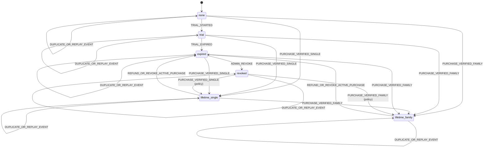

# Entitlement State Machine + Billing Events (Run 5)

## Goal
Define a deterministic, server-authoritative entitlement lifecycle for Premium TV Player across API and workers.

## Canonical states
Entitlement state is account-level and can only be mutated by trusted backend logic.

| State | Meaning | Playback allowed | Device cap | Profile cap |
|---|---|---:|---:|---:|
| `none` | No active access and no active trial | No | 0 | 0 |
| `trial` | Trial active and not expired | Yes | 1 | 1 |
| `lifetime_single` | One-time single plan active | Yes | 1 | 1 |
| `lifetime_family` | One-time family plan active | Yes | 5 | 5 |
| `expired` | Access previously granted but no longer valid | No | 0 new logins* | Keep existing profiles; creation blocked |
| `revoked` | Access removed due to refund/revoke/chargeback/policy | No | 0 new logins* | Keep existing profiles; creation blocked |

\*Existing devices are invalidated at next token check if state is `expired`/`revoked` and no grace policy applies.

## Transition table (deterministic)

| From | Event | Guard conditions | To | Notes |
|---|---|---|---|---|
| `none` | `TRIAL_STARTED` | account `trial_consumed = false` | `trial` | Set `trial_started_at`, `trial_ends_at`, mark `trial_consumed=true`. |
| `none` | `PURCHASE_VERIFIED_SINGLE` | valid purchase token + not refunded | `lifetime_single` | Set `activated_at`, clear `expires_at`. |
| `none` | `PURCHASE_VERIFIED_FAMILY` | valid purchase token + not refunded | `lifetime_family` | Set `activated_at`, clear `expires_at`. |
| `trial` | `TRIAL_EXPIRED` | now >= `trial_ends_at` | `expired` | Scheduler or read-time transition. |
| `trial` | `PURCHASE_VERIFIED_SINGLE` | valid purchase token | `lifetime_single` | Purchase supersedes trial. |
| `trial` | `PURCHASE_VERIFIED_FAMILY` | valid purchase token | `lifetime_family` | Purchase supersedes trial. |
| `lifetime_single` | `PURCHASE_VERIFIED_FAMILY` | product upgrade recognized | `lifetime_family` | Upgrade path; keep purchase history. |
| `lifetime_single` | `REFUND_OR_REVOKE_ACTIVE_PURCHASE` | purchase linked to entitlement | `expired` | If trial was consumed previously; else `none` (see rule R-7). |
| `lifetime_family` | `REFUND_OR_REVOKE_ACTIVE_PURCHASE` | purchase linked to entitlement | `expired` | If trial consumed previously; else `none` (see rule R-7). |
| `expired` | `PURCHASE_VERIFIED_SINGLE` | valid purchase token | `lifetime_single` | Reactivation. |
| `expired` | `PURCHASE_VERIFIED_FAMILY` | valid purchase token | `lifetime_family` | Reactivation. |
| `expired` | `ADMIN_REVOKE` | support/security action | `revoked` | Explicit revocation. |
| `revoked` | `PURCHASE_VERIFIED_SINGLE` | business policy allows new purchase | `lifetime_single` | Optional policy gate. |
| `revoked` | `PURCHASE_VERIFIED_FAMILY` | business policy allows new purchase | `lifetime_family` | Optional policy gate. |
| any | `DUPLICATE_OR_REPLAY_EVENT` | same provider event id already processed | no-op | Idempotent no-op; return current state. |

## Billing event mapping

| External billing signal | Normalized event | State effect |
|---|---|---|
| Play purchase acknowledged as valid (single SKU) | `PURCHASE_VERIFIED_SINGLE` | Set state to `lifetime_single` |
| Play purchase acknowledged as valid (family SKU) | `PURCHASE_VERIFIED_FAMILY` | Set state to `lifetime_family` |
| Restore finds owned single SKU | `PURCHASE_VERIFIED_SINGLE` | Restore to `lifetime_single` |
| Restore finds owned family SKU | `PURCHASE_VERIFIED_FAMILY` | Restore to `lifetime_family` |
| Refund notification | `REFUND_OR_REVOKE_ACTIVE_PURCHASE` | Set to `expired` or `none` per R-7 |
| Revoke/voided purchase notification | `REFUND_OR_REVOKE_ACTIVE_PURCHASE` | Set to `expired` or `none` per R-7 |
| Chargeback notification | `REFUND_OR_REVOKE_ACTIVE_PURCHASE` + `ADMIN_REVOKE` optional | Usually `revoked` for abuse policy |
| Duplicate token verification request | `DUPLICATE_OR_REPLAY_EVENT` | No-op with idempotent response |
| Replay of already processed message | `DUPLICATE_OR_REPLAY_EVENT` | No-op with idempotent response |

## Trial lifecycle rules

- **R-1 One trial per account:** Trial is keyed to account identity (`firebase_uid`/email mapping) and `trial_consumed`.
- **R-2 Start trigger:** Trial may start at first successful register/login flow where no purchase exists and `trial_consumed=false`.
- **R-3 Consume once:** At trial start, atomically set `trial_consumed=true`; never reset on uninstall/logout/device change.
- **R-4 Expiration:** Trial moves to `expired` when `now >= trial_ends_at`.
- **R-5 Purchase precedence:** A valid purchase always supersedes active trial.
- **R-6 Delete/recreate does not reset:** Re-created account for same identity must not receive a second trial.
- **R-7 Refund fallback:** If a refunded entitlement had prior consumed trial, fallback state is `expired`; otherwise `none`.

## Device/profile cap policy by state

| State | Max active devices | Max profiles | Enforcement |
|---|---:|---:|---|
| `none` | 0 | 0 | deny playback + deny provisioning |
| `trial` | 1 | 1 | API validates before `/auth/login` and `/profiles` create |
| `lifetime_single` | 1 | 1 | API validates device/profile mutations |
| `lifetime_family` | 5 | 5 | API validates device/profile mutations |
| `expired` | 0 new | 0 new | existing data retained; creation/login denied |
| `revoked` | 0 new | 0 new | force sign-out path + deny playback |

## Idempotency and conflict resolution

### Idempotency keys
- Billing worker must persist and dedupe on `(provider, purchase_token, provider_event_id)`.
- API verification endpoint should include a `request_id`; repeated requests with same semantic payload return same result.

### Concurrency rules
- **Single writer policy:** Billing worker owns final purchase reconciliation; API can issue provisional check but must reconcile with worker output.
- **Row-level transaction:** lock entitlement row (`SELECT ... FOR UPDATE`) before transition.
- **Monotonic event ordering:** process by provider event time where available; on tie use ingestion id ordering.
- **Last valid event wins:** ignore stale events older than currently recorded terminal action for the same purchase token.

### Conflict examples
1. **Simultaneous restore + refund:** refund event has higher precedence; final state cannot remain purchased.
2. **Duplicate verify calls:** second call is no-op and returns current entitlement.
3. **Upgrade single→family while replay single arrives later:** keep `lifetime_family`; replay single becomes stale no-op.

## Error semantics
These codes are returned in the standard API error envelope:

- `UNAUTHORIZED` — missing/invalid auth, revoked device token, or token mismatch.
- `SLOT_FULL` — device cap reached for current entitlement.
- `PIN_INVALID` — profile PIN validation failed.
- `ENTITLEMENT_REQUIRED` — playback/protected action attempted in `none`/`expired`/`revoked`.
- `VALIDATION_ERROR` — malformed request payload or rule violation.

## Mermaid state diagram

## Implementation checklist for Run 8/9
- Create pure transition function `(currentState, event, context) -> nextState | error`.
- Centralize guard evaluation (trial consumed, purchase validity, policy flags).
- Persist transition audit entries for every mutation with old/new state and cause.
- Expose deterministic transition unit tests per table above.
