# Premium TV Player — User Flows (V1, Android TV)

**Document owner:** project lead
**Last updated:** 2026-04-12 (Run 2)

All flows below are the authoritative V1 reference. UI, API, and backend runs MUST follow them. If a flow needs to change, update this file and note the change in `CLAUDE.md` → Parking Lot or Run Log.

Conventions
- `App` = Android TV client
- `API` = own NestJS backend
- `FBA` = Firebase Authentication
- `Play` = Google Play Billing
- `EPG-W` = EPG worker service

---

## 1. Onboarding (first launch, no account)

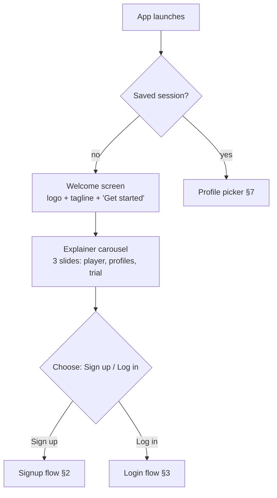

Acceptance
- No account → user reaches Welcome in < 2 s after splash.
- Explainer is skippable.
- No source/content visible before login.

---

## 2. Signup

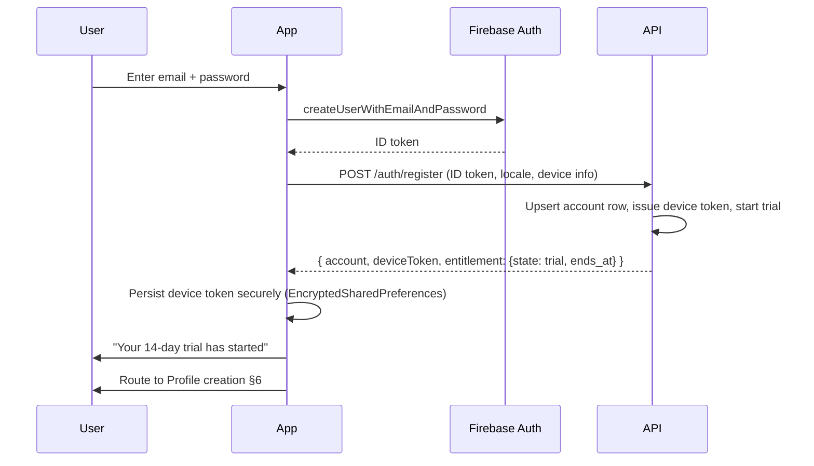

Rules
- Email uniqueness is enforced by Firebase.
- **Trial starts here, server-side.** Client does not compute trial end.
- Device token is an opaque, server-issued string scoped to this install.

Errors
- Invalid email → inline error, don't navigate.
- Weak password → inline error.
- Network → toast + retry button; no partial account created.

---

## 3. Login

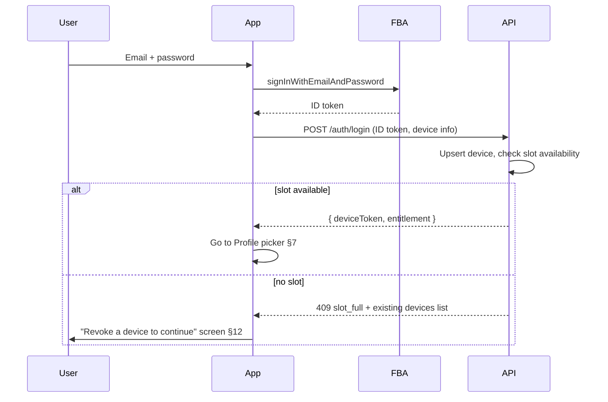

Rules
- If entitlement is `expired` or `none`, login still succeeds; user lands in a restricted state with a clear Upgrade CTA.
- Device slots are checked server-side on every login.

---

## 4. Trial activation (automatic)

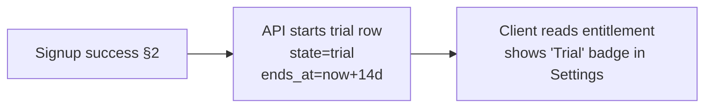

Rules
- One trial per account, ever. Re-registration after deletion does not re-issue a trial to the same email.
- Trial does not auto-convert. When `ends_at` passes, state flips to `expired` and app surfaces an Upgrade screen at next entitlement check.

---

## 5. Purchase (Single or Family Lifetime)

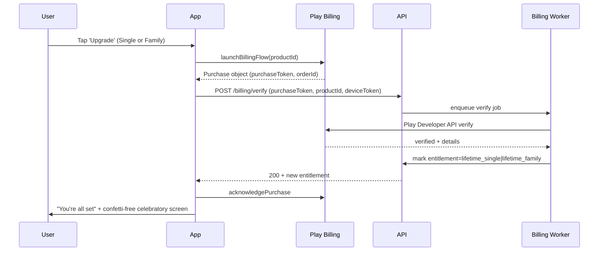

Rules
- Server is authoritative: app does not flip entitlement on its own.
- Acknowledge only **after** server confirmation. Unacknowledged purchases auto-refund per Play policy.
- On Family purchase, device slot cap raises from 1 → 5.

Errors
- Verification fails → show "We couldn't confirm your purchase. Try Restore."
- Network loss mid-flow → Restore flow §6 recovers.

---

## 6. Restore Purchase

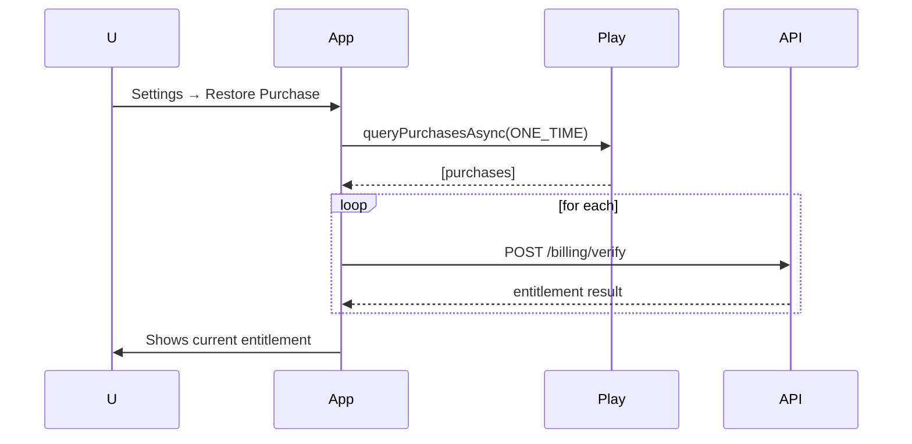

Rules
- Always available, never hidden.
- Also runs silently on Login if entitlement is `none` but a signed-in Play account owns the product.

---

## 7. Profile picker (after login)

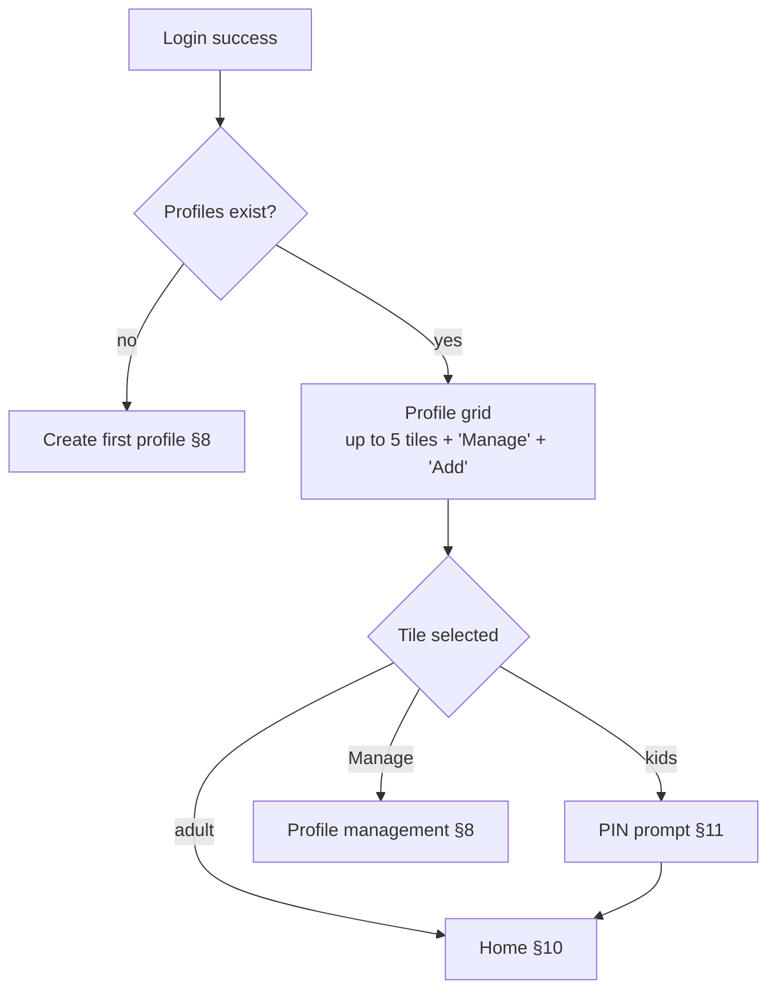

---

## 8. Profile creation / management

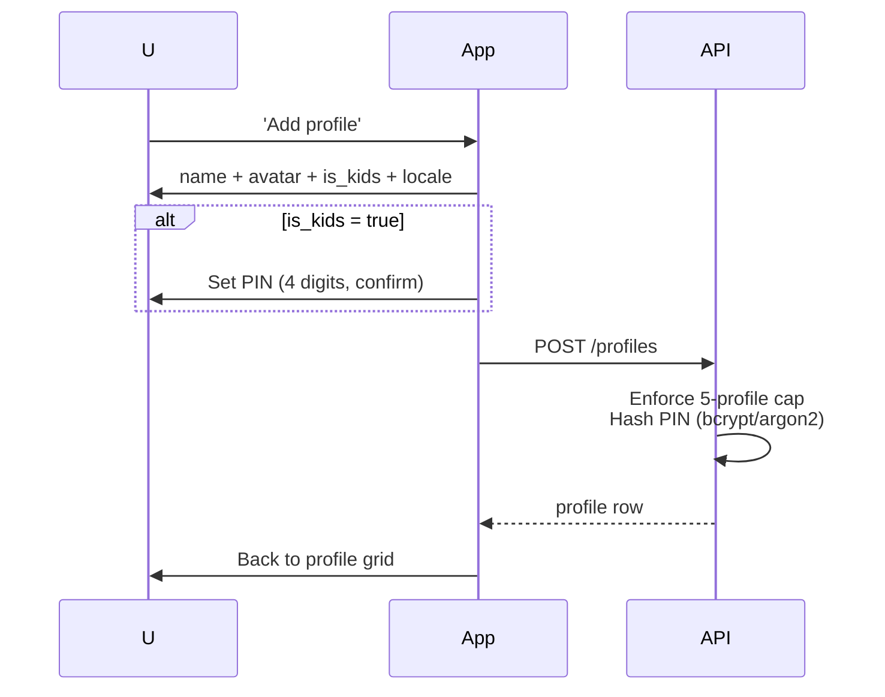

Rules
- Max 5 profiles per account (Family); 1 profile (Single).
- PIN is stored as hash only, salted per profile.
- PIN reset requires account password re-auth.

---

## 9. Add source (M3U / XMLTV)

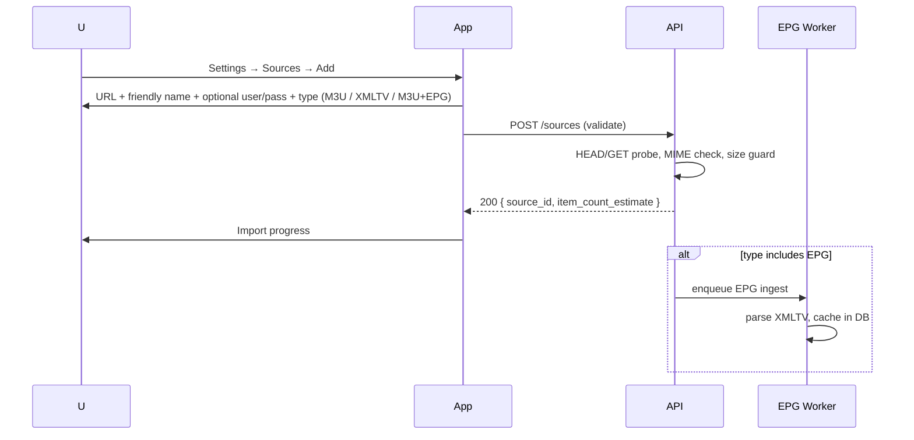

Rules
- URL is stored encrypted at rest; optional credentials are stored encrypted.
- Source body is never proxied or stored in full; only metadata + EPG cache.
- Max N sources per profile (default 10, configurable).

Errors
- Unreachable URL → inline error with retry.
- Unsupported format → explain supported types.

---

## 10. Home screen

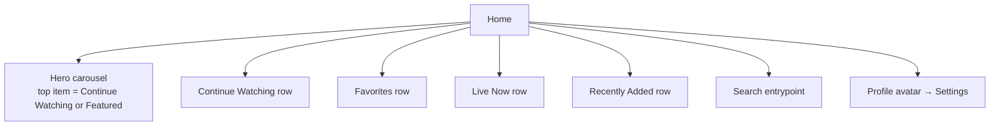

Rules
- All rows are populated from the active profile's data + user's own sources.
- Empty state copy when a row has nothing yet.
- First focus lands on the hero on cold launch.

---

## 11. Kids PIN gate

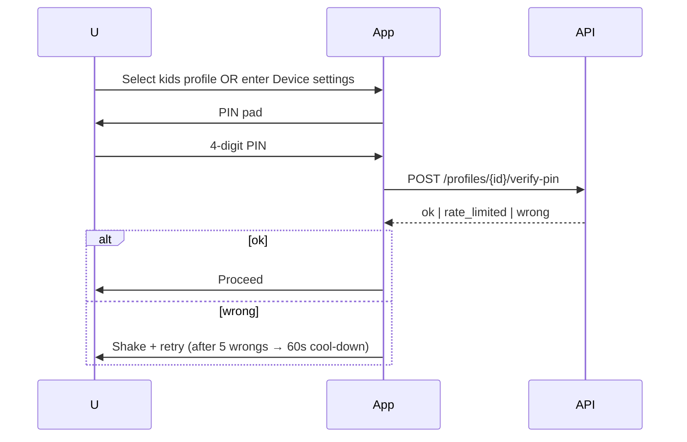

Rules
- PIN verification is server-side (prevents local bypass).
- Rate limit: 5 attempts per 60 s per profile per device.

---

## 12. Device management

```mermaid
flowchart LR
  S[Settings → Devices] --> L[Current device info]
  S --> O[Other devices list]
  O --> A{Action}
  A -- Rename --> R[PUT /devices/{id}]
  A -- Revoke --> V[DELETE /devices/{id}]
  V --> N[Revoked device forced to logout on next API call]
```

Rules
- User can always revoke other devices; cannot revoke current device (must log out instead).
- Revocation is instant server-side; affected device shows "Signed out" screen on next request.

---

## 13. Playback (Live, VOD, Resume)

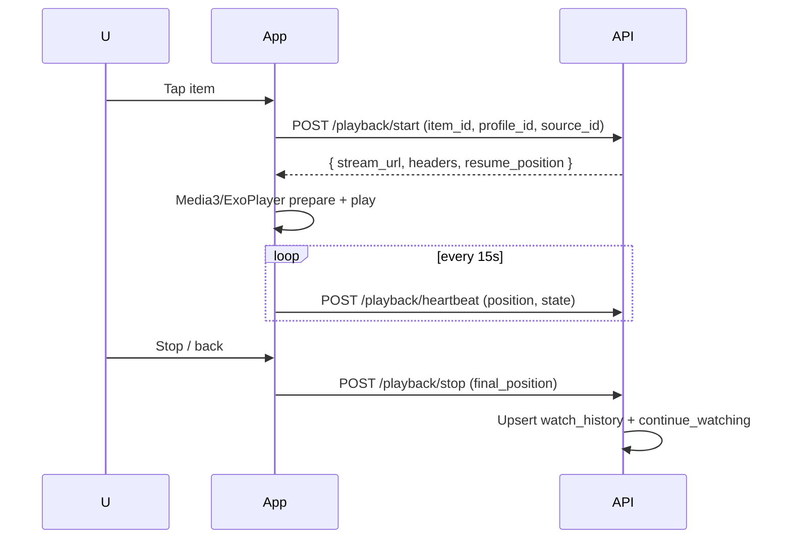

Rules
- Heartbeat interval: 15 s.
- On network loss: buffer heartbeats locally, flush on reconnect.
- Resume prompt ("Resume from 34:12?" / "Start over") if last position is between 30 s and end-minus-60 s.

---

## 14. Logout

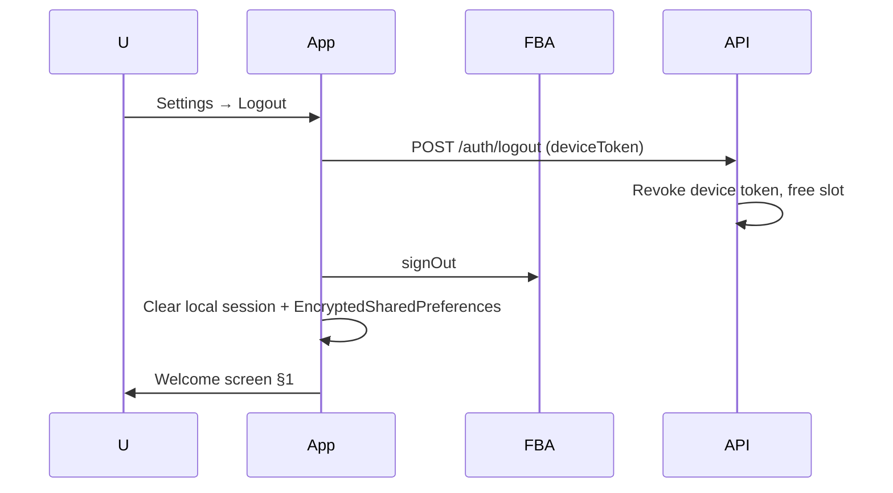

---

## 15. Expired / Revoked state

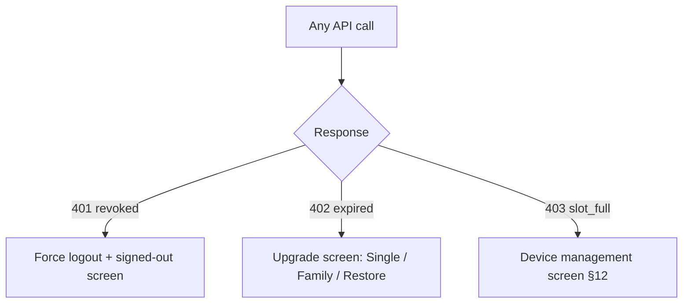

Rules
- These states are handled by a single global API interceptor in the app.
- User can still browse Settings → Account → Logout.
- No playback allowed in `expired` / `revoked` states.

---

## 16. Error & diagnostics surfaces

- Every flow must render a consistent error card: title, short message, primary action ("Try again"), secondary ("Report").
- "Report" generates a redacted diagnostics bundle (no source URLs, no PII beyond account id).
- Diagnostics screen accessible from Settings for advanced users.

---

## 17. First-run happy path (summary)

1. Welcome → Sign up
2. Account created + 14-day trial started server-side
3. First profile created (adult)
4. Add source (user provides M3U or XMLTV URL)
5. Source validates, EPG ingests if applicable
6. Home populates — user watches something
7. Day 14 approaches → in-app reminder → Upgrade → Play Billing → Lifetime
